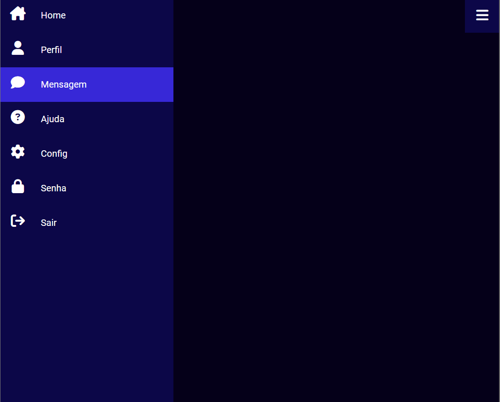

# Menu Lateral

Desenvolvido para aprendizado, menu lateral. 30/12/2022

[🔗 Clique aqui para acessar] (https://michel-maia.github.io/Menu-Lateral/)

## 💻 Tecnologias

- HTML
- CSS
- Javascript

## Referência

- [fontawesome] [https://fontawesome.com/v5/docs/web/advanced/css-pseudo-elements]
- [youtube] [https://www.youtube.com/@resolvendobug2635]
